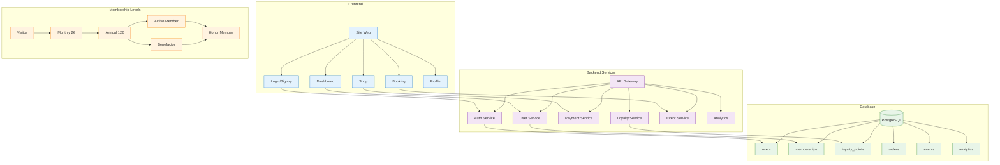
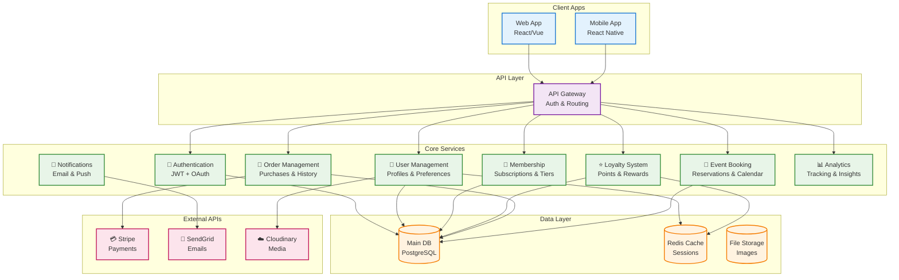
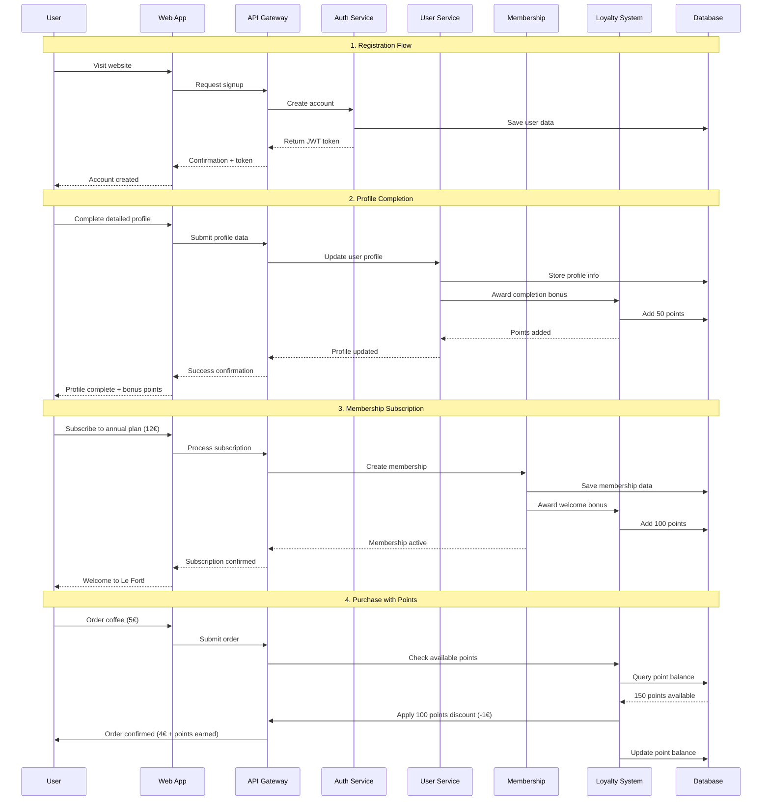
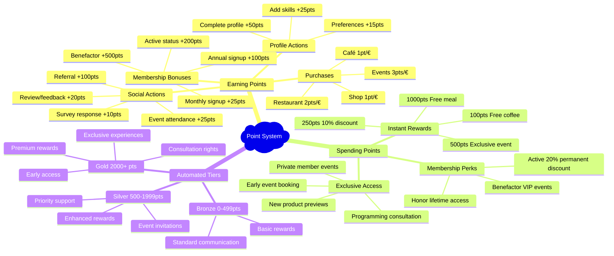
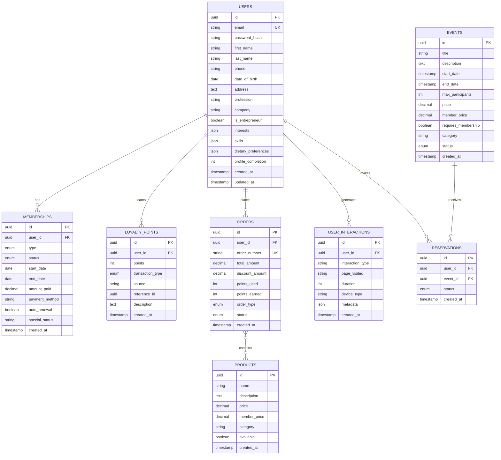

# 🏰 Le Fort - Diagrammes Techniques Exportables

## 📋 Guide d'Export des Diagrammes

### 🔧 **Méthodes d'Export Recommandées**

#### 1. **Mermaid Live Editor** ⭐ (Recommandé)
- **URL** : https://mermaid.live/
- **Étapes** :
  1. Copier le code Mermaid ci-dessous
  2. Le coller dans l'éditeur
  3. Cliquer "Export" → Choisir le format
  4. **PNG** (présentations) ou **SVG** (qualité vectorielle)

#### 2. **Extensions VS Code**
- Installer : `Mermaid Markdown Syntax Highlighting`
- Installer : `Markdown Preview Mermaid Support` 
- Ouvrir ce fichier → `Ctrl+Shift+V` pour prévisualiser

#### 3. **Outils en Ligne**
- **Draw.io** : Peut importer du Mermaid
- **GitHub/GitLab** : Rendu natif dans README
- **Notion** : Blocs Mermaid supportés

---

## 🗺️ **Diagramme 1 : Vue d'Ensemble Système**

---

## ⚙️ **Diagramme 2 : Architecture Microservices**

---

## 🔄 **Diagramme 3 : Flux Utilisateur Complet**

---

## 🎯 **Diagramme 4 : Gamification & Engagement**

---

## 🗄️ **Diagramme 5 : Structure Base de Données Détaillée**

---

## 📊 **Instructions d'Export**

### 🖼️ **Pour Export PNG/SVG (Recommandé)**
1. Aller sur https://mermaid.live/
2. Copier un diagramme ci-dessus
3. Coller dans l'éditeur
4. Cliquer "Export" → PNG (1080p) ou SVG
5. Télécharger et utiliser dans présentations

### 📄 **Pour Documents**
- **Word/PowerPoint** : Utiliser PNG haute résolution
- **Figma/Adobe** : Utiliser SVG pour édition
- **Web** : SVG pour qualité responsive

### 🔄 **Pour Mise à Jour**
- Modifier le code Mermaid ici
- Re-exporter depuis Mermaid Live
- Garder ce fichier comme source de vérité

---

*Diagrammes créés pour Le Fort - Architecture Technique*  
*Dernière mise à jour : $(date)* 