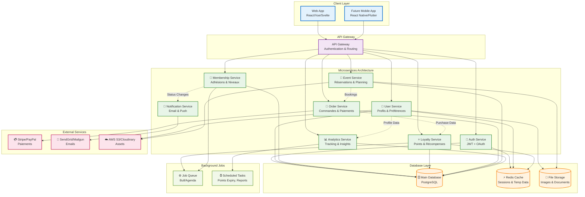
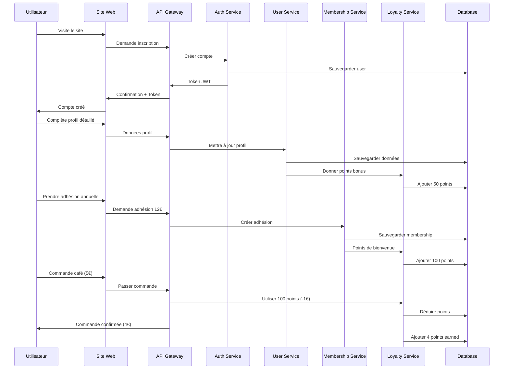
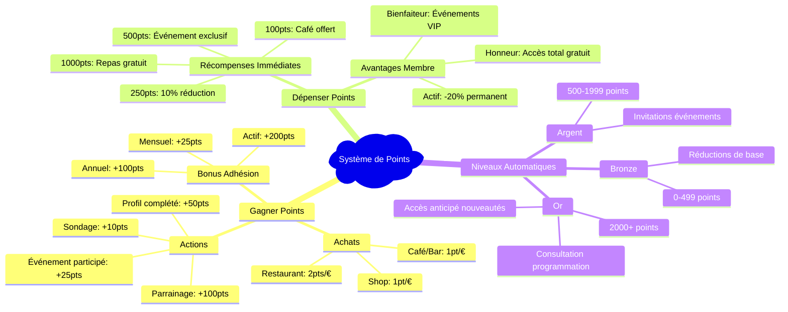

# 🏰 Le Fort - Diagrammes Techniques

## 📋 Comment Exporter et Visualiser les Diagrammes

### 🔧 **Méthodes d'Export Recommandées**

#### 1. **Mermaid Live Editor** (Le plus simple)
- Aller sur : https://mermaid.live/
- Copier-coller le code Mermaid ci-dessous
- Cliquer sur "Export" → Choisir le format :
  - **PNG** : Pour documents/présentations
  - **SVG** : Pour qualité vectorielle
  - **PDF** : Pour impression

#### 2. **Extension VS Code**
- Installer : "Mermaid Markdown Syntax Highlighting"
- Installer : "Markdown Preview Mermaid Support"
- Ouvrir ce fichier dans VS Code
- Ctrl+Shift+V pour prévisualiser

#### 3. **Outils en Ligne**
- **Draw.io/Diagrams.net** : Importer Mermaid
- **GitHub/GitLab** : Affichage natif dans les README
- **Notion** : Support natif des blocs Mermaid

---

## 🗺️ **Diagramme 1 : Architecture Générale du Système**

```mermaid
graph TD
    subgraph "Frontend - Interface Utilisateur"
        A[Site Web Responsive] --> A1[Inscription/Login]
        A --> A2[Dashboard Membre]
        A --> A3[Boutique En Ligne]
        A --> A4[Réservations]
        A --> A5[Profil Utilisateur]
    end

    subgraph "Backend - API & Services"
        B[API REST/GraphQL] --> B1[Auth Service]
        B --> B2[Membership Service]
        B --> B3[Payment Service]
        B --> B4[Loyalty Service]
        B --> B5[Event Service]
        B --> B6[Analytics Service]
    end

    subgraph "Base de Données"
        C[(PostgreSQL/Supabase)] --> C1[users]
        C --> C2[memberships]
        C --> C3[loyalty_points]
        C --> C4[orders]
        C --> C5[events]
        C --> C6[user_interactions]
        C --> C7[products]
        C --> C8[reservations]
    end

    subgraph "Système de Membres"
        D[Visiteur] --> D1[Adhérent Mensuel<br/>2€/mois]
        D1 --> D2[Adhérent Annuel<br/>12€/an + Points]
        D2 --> D3[Adhérent Actif<br/>-20% + Exclusivités]
        D2 --> D4[Bienfaiteur<br/>Dons + Reconnaissance]
        D3 --> D5[Membre Honneur<br/>Carte à Vie]
        D4 --> D5
    end

    subgraph "Espaces Physiques"
        E[Le Fort] --> E1[Café-Bar<br/>Social Hub]
        E --> E2[Restaurant<br/>Brunch + Événements]
        E --> E3[Shop<br/>Jardinerie + Boutique]
        E --> E4[Coworking<br/>Lun-Ven Professionnels]
        E --> E5[Espaces Événements<br/>Culture + Collaboration]
    end

    subgraph "Flux Business"
        F[Acquisition] --> F1[Profil Détaillé<br/>Métier + Préférences]
        F1 --> F2[Personnalisation<br/>Communication Ciblée]
        F2 --> F3[Engagement<br/>Points + Récompenses]
        F3 --> F4[Fidélisation<br/>Communauté Active]
        F4 --> F5[Ambassadeurs<br/>Bouche-à-Oreille]
    end

    subgraph "Analytics & Intelligence"
        G[Tracking Comportement] --> G1[Pages Visitées]
        G --> G2[Temps Passé]
        G --> G3[Actions Utilisateur]
        G1 --> G4[Recommandations IA]
        G2 --> G4
        G3 --> G4
        G4 --> G5[Communication Personnalisée]
        G4 --> G6[Optimisation Offres]
    end

    %% Connexions entre les modules
    A1 --> B1
    A2 --> B2
    A3 --> B3
    A4 --> B5
    A5 --> B2

    B1 --> C1
    B2 --> C2
    B3 --> C4
    B4 --> C3
    B5 --> C5
    B6 --> C6

    D1 --> E1
    D2 --> E2
    D3 --> E3
    D2 --> E4
    D3 --> E5

    F1 --> G
    F3 --> B4
    G5 --> A2

    %% Styles
    classDef frontend fill:#e1f5fe,stroke:#01579b,stroke-width:2px
    classDef backend fill:#f3e5f5,stroke:#4a148c,stroke-width:2px
    classDef database fill:#e8f5e8,stroke:#1b5e20,stroke-width:2px
    classDef business fill:#fff3e0,stroke:#e65100,stroke-width:2px
    classDef analytics fill:#fce4ec,stroke:#880e4f,stroke-width:2px

    class A,A1,A2,A3,A4,A5 frontend
    class B,B1,B2,B3,B4,B5,B6 backend
    class C,C1,C2,C3,C4,C5,C6,C7,C8 database
    class D,D1,D2,D3,D4,D5,E,E1,E2,E3,E4,E5,F,F1,F2,F3,F4,F5 business
    class G,G1,G2,G3,G4,G5,G6 analytics
```

---

## ⚙️ **Diagramme 2 : Architecture Technique Backend**

---

## 🔄 **Diagramme 3 : Flux Utilisateur et Données**

---

## 🎯 **Diagramme 4 : Système de Gamification**

---

## 📊 **Améliorations Techniques Suggérées**

### 🚀 **Optimisations Backend**
1. **Cache Redis** pour les sessions et données fréquentes
2. **API GraphQL** pour requêtes optimisées frontend
3. **Microservices** pour scalabilité et maintenance
4. **Job Queue** pour tâches asynchrones (emails, points)
5. **Analytics en temps réel** avec webhooks

### 🔐 **Sécurité**
1. **JWT + Refresh Tokens** pour authentification
2. **Rate limiting** sur API
3. **Validation stricte** des données utilisateur
4. **Chiffrement** des données sensibles
5. **Audit logs** pour traçabilité

### 📱 **UX/UI**
1. **Progressive Web App** (PWA) pour expérience mobile
2. **Notifications push** pour engagement
3. **Dashboard temps réel** des points et statut
4. **Onboarding gamifié** pour complétion profil
5. **Interface admin** pour gestion membres

---

## 🎪 **Prochaines Étapes**

1. **Phase 1** : Développer MVP avec inscription + profils
2. **Phase 2** : Système de paiement et adhésions
3. **Phase 3** : Gamification et points de fidélité
4. **Phase 4** : Analytics avancées et recommandations IA
5. **Phase 5** : Application mobile native

---

*Document créé le : $(date)*
*Dernière mise à jour : Aujourd'hui* 