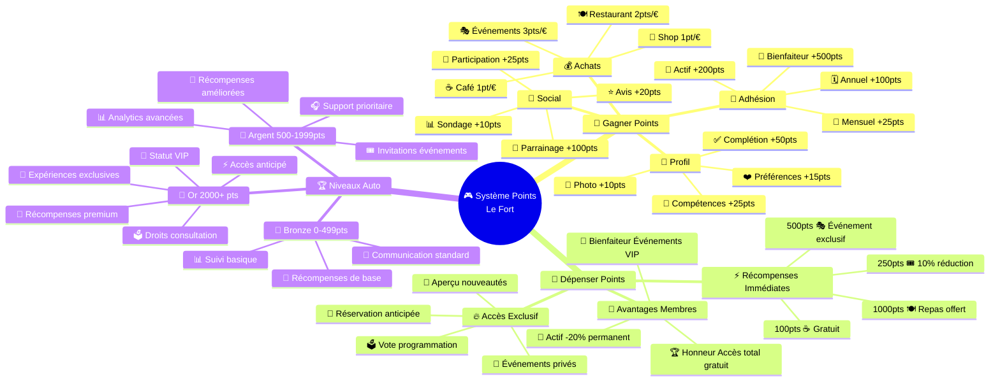
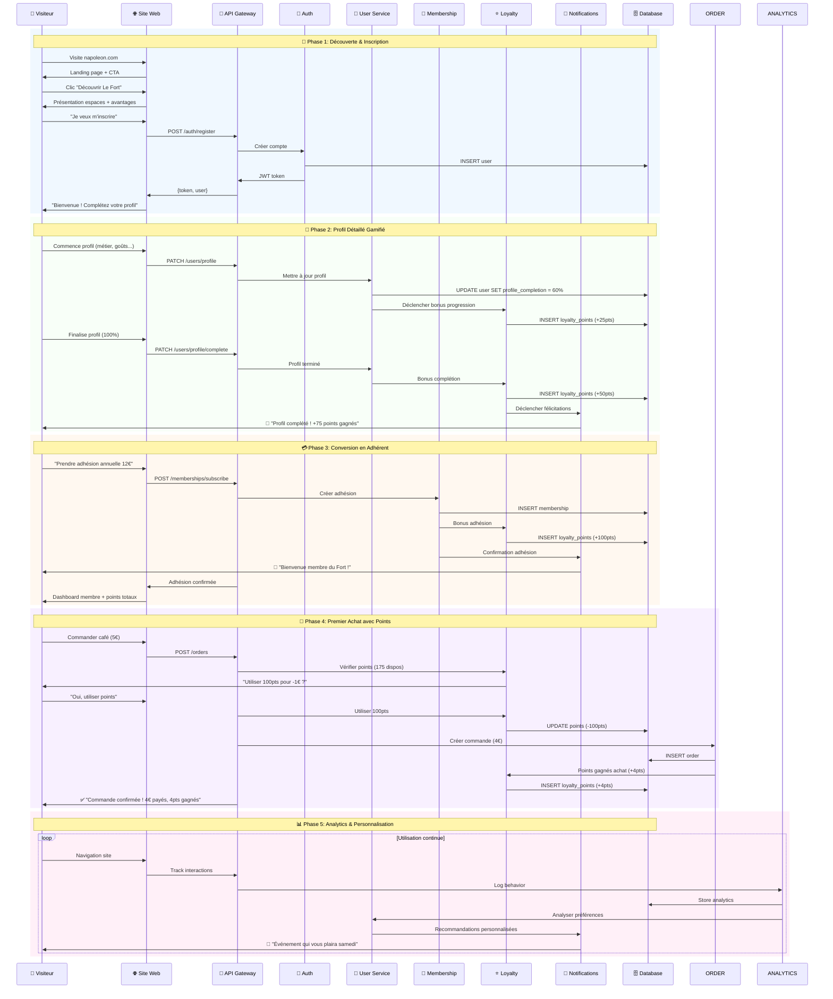

# 🏰 Le Fort - Diagrammes Techniques

## 📥 **Comment Exporter ces Diagrammes**

### 🎯 **Méthode Recommandée : Mermaid Live**
1. **Aller sur** : https://mermaid.live/
2. **Copier** le code d'un diagramme ci-dessous
3. **Coller** dans l'éditeur en ligne
4. **Exporter** en PNG (HD) ou SVG (vectoriel)
5. **Utiliser** dans vos présentations/documents

---

## 🗺️ **Diagramme 1 : Architecture Système Complète**

```mermaid
graph TD
    subgraph "Frontend Layer"
        A[Site Web Responsive] --> A1[🔐 Login/Signup]
        A --> A2[📊 Dashboard Membre]
        A --> A3[🛒 Boutique En Ligne]
        A --> A4[📅 Réservations]
        A --> A5[👤 Profil Utilisateur]
    end

    subgraph "Backend API Services"
        B[🌐 API Gateway] --> B1[🔐 Auth Service]
        B --> B2[👥 User Service]
        B --> B3[💳 Payment Service]
        B --> B4[⭐ Loyalty Service]
        B --> B5[📅 Event Service]
        B --> B6[📊 Analytics Service]
    end

    subgraph "Database PostgreSQL"
        C[(🗄️ Main Database)] --> C1[users]
        C --> C2[memberships]
        C --> C3[loyalty_points]
        C --> C4[orders]
        C --> C5[events]
        C --> C6[user_interactions]
        C --> C7[products]
        C --> C8[reservations]
    end

    subgraph "Système Adhésions"
        D[👋 Visiteur] --> D1[📝 Mensuel 2€]
        D1 --> D2[⭐ Annuel 12€]
        D2 --> D3[🚀 Actif -20%]
        D2 --> D4[💝 Bienfaiteur]
        D3 --> D5[🏆 Honneur à Vie]
        D4 --> D5
    end

    subgraph "Espaces Physiques Le Fort"
        E[🏰 Le Fort] --> E1[☕ Café-Bar Hub Social]
        E --> E2[🍽️ Restaurant Brunch]
        E --> E3[🌱 Shop Jardinerie]
        E --> E4[💼 Coworking Lun-Ven]
        E --> E5[🎭 Événements Culture]
    end

    %% Connexions Frontend → Backend
    A1 --> B1
    A2 --> B2
    A3 --> B3
    A4 --> B5
    A5 --> B2

    %% Connexions Backend → Database
    B1 --> C1
    B2 --> C2
    B3 --> C4
    B4 --> C3
    B5 --> C5
    B6 --> C6

    %% Flux métier
    D2 --> B4
    E1 --> D1
    E2 --> D2

    %% Styles visuels
    classDef frontend fill:#e3f2fd,stroke:#1976d2,stroke-width:2px
    classDef backend fill:#f3e5f5,stroke:#7b1fa2,stroke-width:2px
    classDef database fill:#e8f5e8,stroke:#388e3c,stroke-width:2px
    classDef membership fill:#fff3e0,stroke:#f57c00,stroke-width:2px
    classDef physical fill:#fce4ec,stroke:#c2185b,stroke-width:2px

    class A,A1,A2,A3,A4,A5 frontend
    class B,B1,B2,B3,B4,B5,B6 backend
    class C,C1,C2,C3,C4,C5,C6,C7,C8 database
    class D,D1,D2,D3,D4,D5 membership
    class E,E1,E2,E3,E4,E5 physical
```



---

## ⚙️ **Diagramme 2 : Architecture Microservices Backend**

```mermaid
flowchart TB
    subgraph "Clients"
        WEB["🌐 Web App<br/>React/Next.js"]
        MOBILE["📱 Mobile App<br/>React Native"]
        ADMIN["⚙️ Admin Panel<br/>Dashboard"]
    end

    subgraph "API Gateway & Auth"
        GATEWAY["🚪 API Gateway<br/>Rate Limiting + Routing"]
        AUTH["🔐 Authentication<br/>JWT + Refresh Tokens"]
    end

    subgraph "Core Business Services"
        USER["👤 User Service<br/>Profiles + Preferences"]
        MEMBER["🎫 Membership Service<br/>Subscriptions + Tiers"]
        LOYALTY["⭐ Loyalty Service<br/>Points + Rewards"]
        ORDER["🛒 Order Service<br/>Purchases + History"]
        EVENT["📅 Event Service<br/>Bookings + Calendar"]
        NOTIF["📱 Notification Service<br/>Email + Push + SMS"]
        ANALYTICS["📊 Analytics Service<br/>Tracking + ML Insights"]
        CONTENT["📝 Content Service<br/>CMS + Media"]
    end

    subgraph "Data & Storage"
        MAIN[("🗄️ PostgreSQL<br/>Transactional Data")]
        CACHE[("⚡ Redis<br/>Cache + Sessions")]
        SEARCH[("🔍 Elasticsearch<br/>Search + Analytics")]
        FILES[("📁 S3/Cloudinary<br/>Media Storage")]
    end

    subgraph "External Services"
        PAYMENT["💳 Stripe<br/>Payments + Subscriptions"]
        EMAIL["📧 SendGrid<br/>Transactional Emails"]
        PUSH["📱 Firebase<br/>Push Notifications"]
        SMS["📞 Twilio<br/>SMS Notifications"]
    end

    subgraph "Background Processing"
        QUEUE["⚙️ Bull Queue<br/>Background Jobs"]
        SCHEDULER["⏰ Cron Jobs<br/>Scheduled Tasks"]
        WORKER["👷 Workers<br/>Async Processing"]
    end

    %% Client connections
    WEB --> GATEWAY
    MOBILE --> GATEWAY
    ADMIN --> GATEWAY

    %% Gateway routing
    GATEWAY --> AUTH
    GATEWAY --> USER
    GATEWAY --> MEMBER
    GATEWAY --> LOYALTY
    GATEWAY --> ORDER
    GATEWAY --> EVENT
    GATEWAY --> NOTIF
    GATEWAY --> ANALYTICS
    GATEWAY --> CONTENT

    %% Database connections
    USER --> MAIN
    MEMBER --> MAIN
    LOYALTY --> MAIN
    ORDER --> MAIN
    EVENT --> MAIN
    ANALYTICS --> MAIN
    CONTENT --> MAIN

    %% Cache connections
    AUTH --> CACHE
    USER --> CACHE
    LOYALTY --> CACHE
    EVENT --> CACHE

    %% Search connections
    USER --> SEARCH
    EVENT --> SEARCH
    CONTENT --> SEARCH

    %% File storage
    USER --> FILES
    EVENT --> FILES
    CONTENT --> FILES

    %% External service connections
    ORDER --> PAYMENT
    NOTIF --> EMAIL
    NOTIF --> PUSH
    NOTIF --> SMS

    %% Background processing
    LOYALTY --> QUEUE
    MEMBER --> QUEUE
    ANALYTICS --> QUEUE
    QUEUE --> WORKER
    SCHEDULER --> WORKER

    %% Data flow arrows
    USER -.->|"Profile Updates"| ANALYTICS
    ORDER -.->|"Purchase Data"| LOYALTY
    MEMBER -.->|"Status Changes"| NOTIF
    EVENT -.->|"Bookings"| ORDER

    %% Styling
    classDef client fill:#e3f2fd,stroke:#1976d2,stroke-width:3px
    classDef gateway fill:#f3e5f5,stroke:#7b1fa2,stroke-width:2px
    classDef service fill:#e8f5e8,stroke:#388e3c,stroke-width:2px
    classDef data fill:#fff3e0,stroke:#f57c00,stroke-width:2px
    classDef external fill:#fce4ec,stroke:#c2185b,stroke-width:2px
    classDef background fill:#f1f8e9,stroke:#689f38,stroke-width:2px

    class WEB,MOBILE,ADMIN client
    class GATEWAY,AUTH gateway
    class USER,MEMBER,LOYALTY,ORDER,EVENT,NOTIF,ANALYTICS,CONTENT service
    class MAIN,CACHE,SEARCH,FILES data
    class PAYMENT,EMAIL,PUSH,SMS external
    class QUEUE,SCHEDULER,WORKER background
```



---

## 🎯 **Diagramme 3 : Système de Gamification Avancé**



---

## 🔄 **Diagramme 4 : Flux Complet Utilisateur**



---

## 🏗️ **Diagramme 5 : Base de Données ERD Complète**

```mermaid
erDiagram
    USERS {
        uuid id PK
        string email UK "Email unique"
        string password_hash "Mot de passe chiffré"
        string first_name "Prénom"
        string last_name "Nom"
        string phone "Téléphone"
        date date_of_birth "Date naissance"
        text address "Adresse complète"
        string profession "Métier"
        string company "Entreprise"
        boolean is_entrepreneur "Indépendant"
        json interests "Centres d'intérêt"
        json skills "Compétences"
        json dietary_preferences "Régime alimentaire"
        int profile_completion "% profil complété"
        string avatar_url "Photo profil"
        timestamp last_login "Dernière connexion"
        boolean email_verified "Email vérifié"
        timestamp created_at
        timestamp updated_at
    }

    MEMBERSHIPS {
        uuid id PK
        uuid user_id FK
        enum type "mensuel,annuel,actif,bienfaiteur,honneur"
        enum status "active,expired,suspended,cancelled"
        date start_date "Date début"
        date end_date "Date fin"
        decimal amount_paid "Montant payé"
        string payment_method "stripe,paypal,cash"
        boolean auto_renewal "Renouvellement auto"
        string special_status "Statut spécial"
        json benefits "Avantages spécifiques"
        timestamp created_at
        timestamp updated_at
    }

    LOYALTY_POINTS {
        uuid id PK
        uuid user_id FK
        int points "Nombre points +/-"
        enum transaction_type "earned,spent,expired,bonus"
        string source "purchase,profile,referral,event"
        uuid reference_id "ID commande/action"
        text description "Description transaction"
        date expires_at "Date expiration points"
        timestamp created_at
    }

    ORDERS {
        uuid id PK
        uuid user_id FK
        string order_number UK "Numéro commande"
        decimal total_amount "Montant total"
        decimal discount_amount "Remise appliquée"
        int points_used "Points utilisés"
        int points_earned "Points gagnés"
        enum order_type "cafe,restaurant,shop,event"
        enum status "pending,confirmed,completed,cancelled"
        json items "Détail articles"
        string payment_intent_id "Stripe payment ID"
        timestamp completed_at "Date finalisation"
        timestamp created_at
    }

    EVENTS {
        uuid id PK
        string title "Titre événement"
        text description "Description"
        timestamp start_date "Date/heure début"
        timestamp end_date "Date/heure fin"
        int max_participants "Nombre max"
        decimal price "Prix normal"
        decimal member_price "Prix membre"
        boolean requires_membership "Adhésion obligatoire"
        string category "musique,art,food,workshop"
        enum status "draft,published,cancelled,completed"
        json metadata "Images, détails..."
        int current_bookings "Réservations actuelles"
        timestamp created_at
        timestamp updated_at
    }

    RESERVATIONS {
        uuid id PK
        uuid user_id FK
        uuid event_id FK
        enum status "pending,confirmed,cancelled,attended"
        decimal amount_paid "Montant payé"
        int guests_count "Nombre accompagnants"
        text special_requests "Demandes spéciales"
        timestamp confirmed_at "Date confirmation"
        timestamp created_at
    }

    PRODUCTS {
        uuid id PK
        string name "Nom produit"
        text description "Description"
        decimal price "Prix normal"
        decimal member_price "Prix membre"
        string category "food,drink,shop,garden"
        json variants "Tailles, options..."
        boolean available "Disponible"
        string image_url "Image produit"
        int stock_quantity "Stock disponible"
        timestamp created_at
        timestamp updated_at
    }

    USER_INTERACTIONS {
        uuid id PK
        uuid user_id FK
        string interaction_type "page_view,click,purchase,search"
        string page_visited "URL visitée"
        int duration "Durée en secondes"
        string device_type "desktop,mobile,tablet"
        json metadata "Données contextuelles"
        string ip_address "Adresse IP"
        string user_agent "Navigateur"
        timestamp created_at
    }

    REFERRALS {
        uuid id PK
        uuid referrer_id FK "Qui parraine"
        uuid referred_id FK "Qui est parrainé"
        enum status "pending,completed,rewarded"
        int points_awarded "Points donnés"
        timestamp completed_at "Date validation"
        timestamp created_at
    }

    SURVEYS {
        uuid id PK
        string title "Titre sondage"
        json questions "Questions JSON"
        enum status "draft,active,closed"
        int points_reward "Points récompense"
        timestamp start_date "Date début"
        timestamp end_date "Date fin"
        timestamp created_at
    }

    SURVEY_RESPONSES {
        uuid id PK
        uuid survey_id FK
        uuid user_id FK
        json answers "Réponses JSON"
        int points_earned "Points gagnés"
        timestamp completed_at "Date soumission"
    }

    %% Relations principales
    USERS ||--o{ MEMBERSHIPS : "a"
    USERS ||--o{ LOYALTY_POINTS : "gagne/dépense"
    USERS ||--o{ ORDERS : "passe"
    USERS ||--o{ RESERVATIONS : "fait"
    USERS ||--o{ USER_INTERACTIONS : "génère"
    USERS ||--o{ REFERRALS : "parraine"
    USERS ||--o{ SURVEY_RESPONSES : "répond"

    EVENTS ||--o{ RESERVATIONS : "reçoit"
    ORDERS }o--o{ PRODUCTS : "contient"
    SURVEYS ||--o{ SURVEY_RESPONSES : "collecte"

    %% Relations de parrainage
    USERS ||--o{ REFERRALS : "est parrainé"
```



---

## 🎨 **Instructions d'Export Optimisées**

### 🖼️ **Export Haute Qualité**
```
1. Mermaid Live (mermaid.live)
   → Coller le code Mermaid
   → Export PNG 2x ou 4x pour HD
   → Ou SVG pour vectoriel

2. VS Code avec extensions
   → Markdown Preview Enhanced
   → Clic droit → Export PNG/SVG

3. GitHub/GitLab
   → Rendu automatique dans README.md
```

### 📱 **Formats Recommandés**
- **Présentations** : PNG 1920x1080
- **Web** : SVG responsive  
- **Impression** : PDF vectoriel
- **Documentation** : PNG 1080p

### 🎯 **Utilisation**
- **Architecture technique** : Diagrammes 1 & 2
- **Présentation business** : Diagrammes 3 & 4  
- **Documentation dev** : Diagramme 5

---

*Créé pour Le Fort - Version exportable optimisée* 